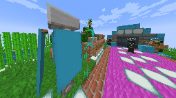

# Tungsten

[Baritone](https://github.com/cabaletta/baritone) that can't build/break blocks and looks like a NASA computing program

Adapted to be used with the [autoclef](https://github.com/3ndetz/autoclef).

## Features

- [x] Fix most of crashes
- [x] `;followPlayer` command

## TODOs

- [ ] Super-Fast pathfinder mode (pvp pathfinding)
- [ ] Make debug printing prettier, move out from the chat

## How to use

1. Download the latest release from the [Releases](https://github.com/3ndetz/Tungsten/releases) section and find the one with `Latest` tag.
2. Install the mod (fabric, `mods` folder). Version of fabric and minecraft must be specidied in the Release description.
3. Use chat command `;followPlayer <playerName>` to follow a player, `;followPlayer stop` to stop following. `;help` for the list of available commands.

## Fork History

1. Origin: **[CaptainWutax/Tungsten](https://github.com/CaptainWutax/Tungsten)** ->
2. Fork: **[Hackerokuz/Tungsten](https://github.com/Hackerokuz/Tungsten)** ->
3. This fork: **[3ndetz/Tungsten](https://github.com/3ndetz/Tungsten)**
